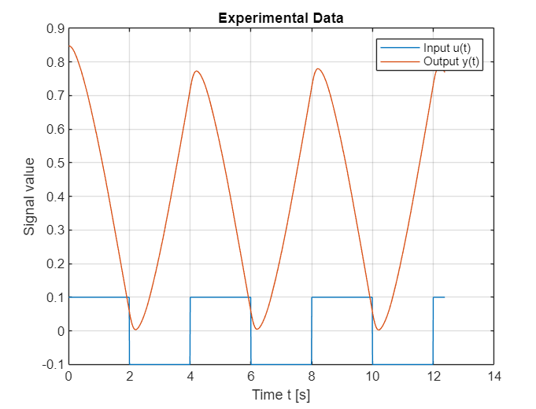
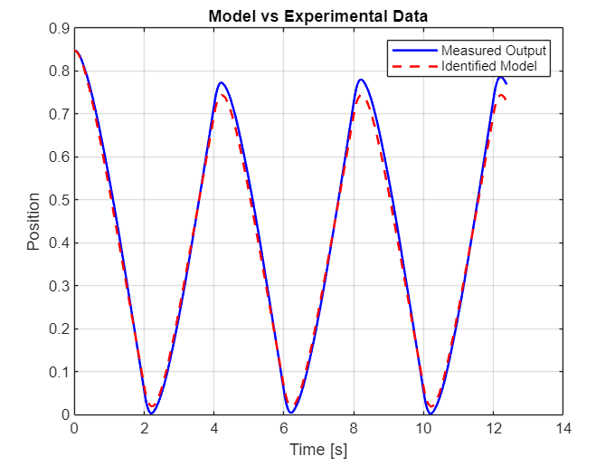
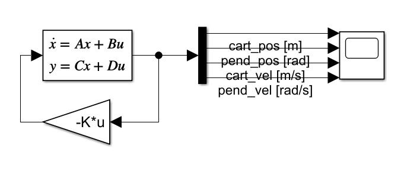
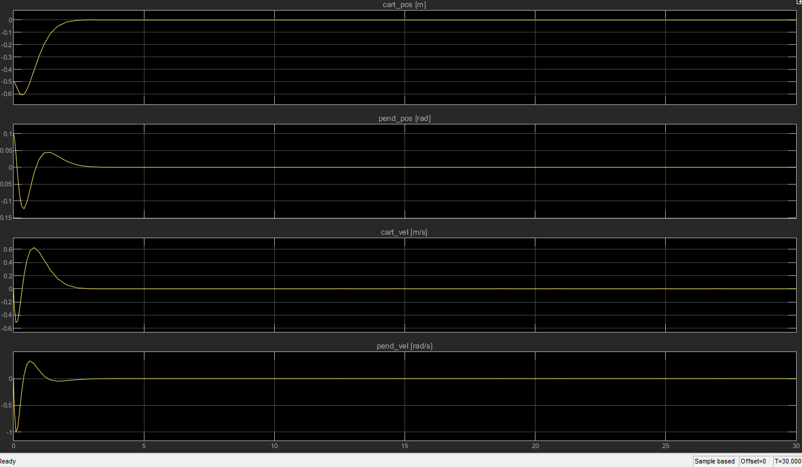
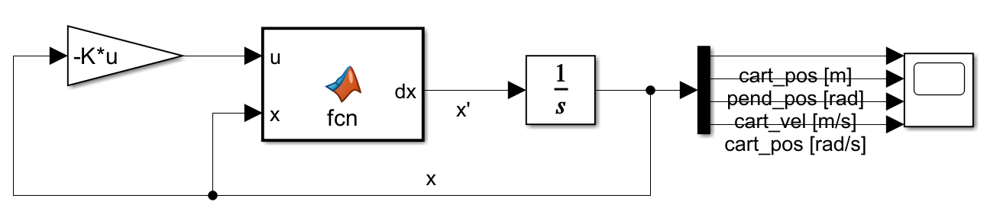
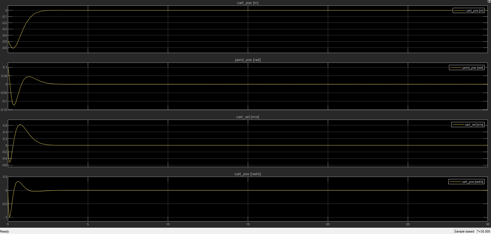

# LQR CART POLE CONTROLLER

This project focuses on stabilization of an inverted pendulum mounted on a cart using Linear Quadratic Regulator (LQR) control. The system was modeled, identified, and validated using both linear and nonlinear approaches in MATLAB/Simulink.
The goal was to design a controller capable of stabilizing an inherently unstable system and to evaluate model accuracy against real system dynamics.

---

## 📸 Project Overview

<p align="center">
  
</p>

---

## ⚙️ Features
- LQR controller design for inverted pendulum stabilization
- Linear and nonlinear system modeling
- System identification using least squares method
- Model validation against experimental data
- Simulation in MATLAB/Simulink

---

## 🛠️ Tools & Technologies
- MATLAB
- Simulink
- Control Systems Theory
- System Identification

---

## 📂 Project Structure

```
LQR-Cart-Pole-Controller/
├── Matlab-code-and-data/
│   ├── cart_inertia_identyfication/
│   │   ├── cart_inertia_identification.mlx
│   │   └── cart_inertia.mat 
│   └── model_parameters_and_calculations/
│       ├── parameters.m    
│       └── partial_diff.m
├── Simukink-models/
│   ├── unlinear_model.slx
│   └── linearised_model.slx
├── images
├── README.md
└── lqr-controller-report.pdf
```

## Cart parameters identification

<p align="center">
  
  
</p>

## Linear and nonlinear model testing 

Linear 
<p align="center">
  
  
</p>

nonlinear
<p align="center">
  
  
</p>

## 📄 Report
Full project report available here:
👉 `lqr-controller-report.pdf`

---


## 👥 Team Project
Developed in collaboration as part of a control systems project.
